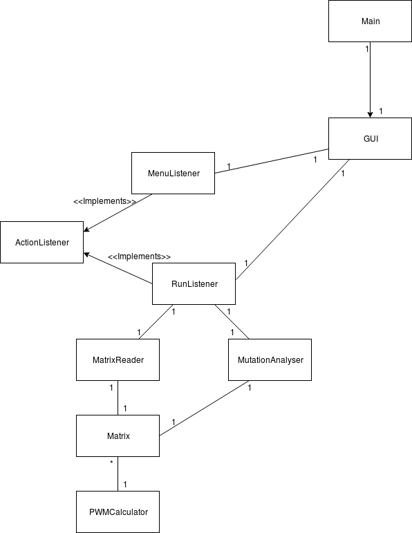

##### Aihe: DNA:n motiiviaffiniteetin muutoksia laskeva ohjelma

Ohjelmalle annetaan syötteenä mutaatiotiedosto (oletusformaattina tn. Variant Call Format, eli VCF). Tästä haetaan transkriptiofaktoreiden sitoutumiskohtien lähistölle osuvat mutaatiot, lasketaan muutokset näiden kyvyssä sitoa transkriptiofaktoreita ja palautetaan tulostiedosto jossain bioinformaattisesti mielekkäässä formaatissa (TBA).

Motiiviaffiniteetin muutokset ovat esimerkiksi syöpätutkimuksessa kiinnostuksen kohteena, sillä geenien vääränlaisella säätelyllä on todistetusti roolinsa syövän kehittymisessä. Motiiviaffiniteettien laskemisen pohjana käytetään <i>positional frequency</i> -matriiseja, joihin on määritetty transkriptiofaktorikohtaisesti nukleotidin (A,T,C tai G) esiintyvyydet motiivin eri positioissa.

##### Käyttäjät

Biologi

- määrittää halutut asetukset kuten käytettävän genomiannotaation
- valitsee tutkittavan transkriptiofaktorin motiiviaffiniteettimatriisin
- syöttää ohjelmalle analysoitavaksi mutaatiotiedoston
- voi myös lisätä analyysiä varten omia tietokantojaan
*  onnistuu, jos ovat oikeassa formaatissa
- MutationAnalyser palauttaa analyysin lopuksi tulostiedoston, joka on muotoa:

CHROM | POS | REF | ALT | SCORE

##### Luokkakaavio

Luokkakaavio kuvastaa tämän hetkistä tilannetta.

##### Checkstyle-raportti

##### Pit-raportti

